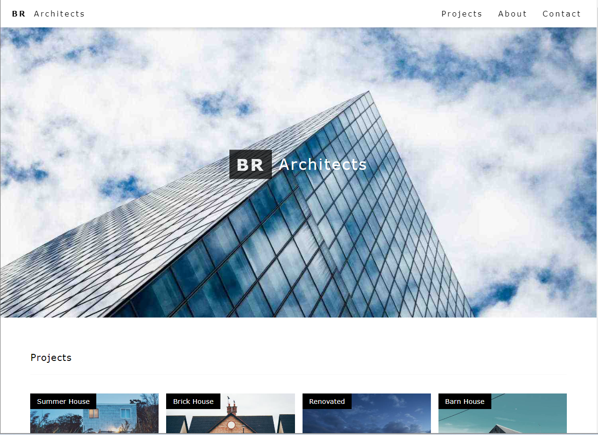

# Architect Template

## Description
This application is designed to be a frontend clone of the w3schools template - Architect Template. This application was created using HTML and CSS.

## Screenshot of Application

## Deployed Application
Click [here](https://angelomarlopez.github.io/ArchitectTemplate/) for Architect Template Live URL.
